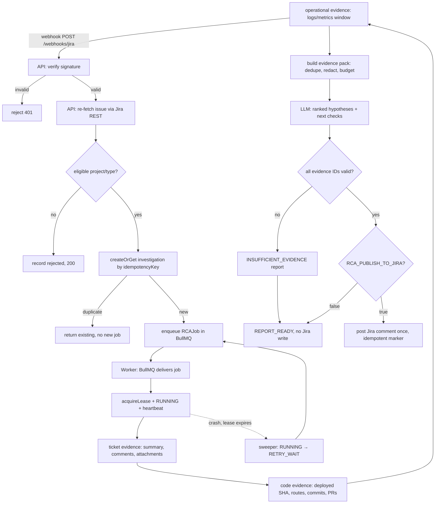
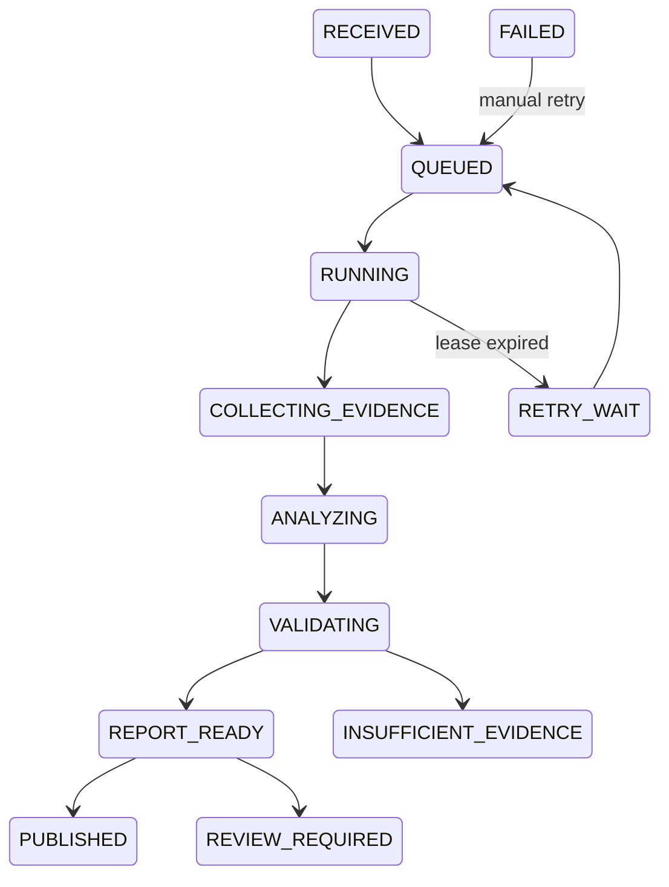

# Ztrace

**AI-generated, evidence-backed preliminary root-cause analysis for production bug tickets — before a developer starts investigating.**

## The problem

Production bug tickets usually arrive with a description and screenshots, but no failing component, code path, recent regression, or next diagnostic step. Developers burn their first hour just gathering context.

## What Ztrace does

1. A Jira Cloud webhook delivers a production-bug ticket to Ztrace.
2. Ztrace re-fetches and normalizes the ticket, checks eligibility, and deduplicates deliveries.
3. A worker investigates permitted systems — the ticket itself, the GitHub monorepo at the deployed commit, and one configured observability source.
4. The LLM produces a structured report: observed facts, ranked hypotheses, recent relevant changes, recommended next checks, and explicit evidence gaps.
5. Every claim must cite a stored evidence item. Weak evidence yields `INSUFFICIENT_EVIDENCE` — never a guessed root cause.
6. The report is posted back to Jira as a comment (when explicitly enabled; **off by default**).



## Operating principles

- **Evidence before explanation** — every material claim points to evidence IDs.
- **Facts and hypotheses are separate.**
- **Abstain when evidence is insufficient.**
- **Shadow mode by default** — `RCA_MODE=shadow`, `RCA_PUBLISH_TO_JIRA=false`.
- **No production writes** — no code changes, no deployments, no production DB queries, no repository script execution.

## Architecture

- **API** (Express) — webhook intake, health endpoints
- **Worker** — asynchronous investigation jobs
- **Queue** — BullMQ + Redis (Upstash in the prototype)
- **State** — PostgreSQL + Prisma (source of truth; Postgres, not the queue, owns investigation state)
- **Integrations** — Jira Cloud REST, read-only GitHub App, observability adapter, optional MongoDB Atlas adapter (disabled until verified), provider-neutral LLM adapter
- **Sandbox** — repository reproduction runs in a dedicated sandbox provider, never on the app host

Deployment target: one small EC2 instance (API + worker as separate Docker Compose services), Caddy for HTTPS, managed Postgres (Neon), managed Redis (Upstash), GHCR, GitHub Actions, Grafana Cloud. See `docs/Ztrace_Infrastructure_Architecture.md`.



## Layout

- `apps/api` — Express API (webhook intake, health endpoints)
- `apps/worker` — background worker entrypoint
- `src/config` — environment validation (`parseEnv`)
- `src/investigation` — state machine, leases, stale-lease sweeper
- `src/persistence` — Prisma client singleton and repositories
- `src/queues` — BullMQ queue definition
- `prisma` — schema and migrations
- `tests` — Vitest unit + integration suites (`tests/setup.ts` forces local services)

## Commands

```bash
npm install            # install deps
docker compose up -d   # local Postgres 16 + Redis 7
npx prisma migrate dev # apply migrations
npm run dev:api        # API with hot reload
npm run dev:worker     # worker with hot reload
npm test               # vitest run
npm run lint           # tsc --noEmit
```

Full walkthrough: `docs/setup.md`.

## Docs

- `docs/setup.md` — local setup guide
- `docs/Ztrace_AI_Coding_Agent_Spec (1).md` — full implementation spec
- `docs/Ztrace_Infrastructure_Architecture.md` — infrastructure & deployment
- `docs/superpowers/plans/` — implementation plans

## Status

Milestone 0+1 scaffold: repo, config validation, Prisma schema, state machine, investigation repository, queue/worker skeleton, lease sweeper, health endpoints. Jira ingestion lands in Milestone 2. Publication remains disabled.
