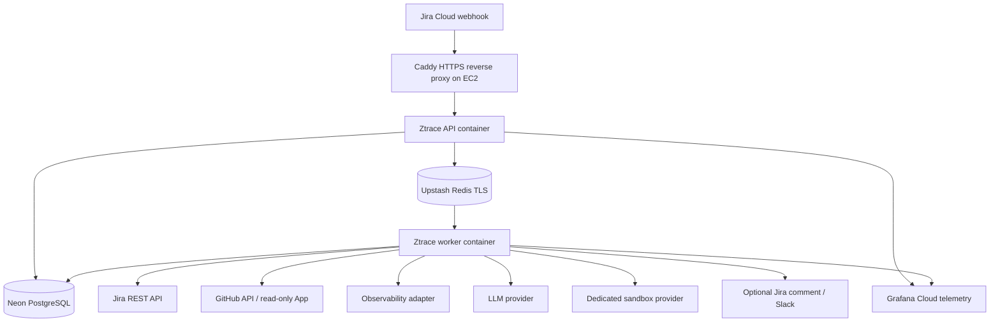
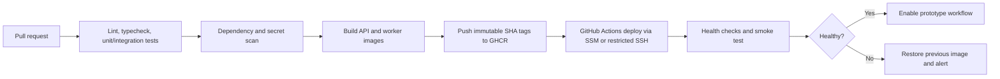

# Ztrace Infrastructure & Deployment Architecture

**Status:** Prototype blueprint  
**Goal:** Learn AWS deployment fundamentals while minimizing fixed monthly cost.  
**Scope:** Personal prototype, shadow mode, no production customer data or autonomous code changes.

## 1. Decisions and assumptions

### Confirmed decisions
- Cloud runtime: AWS.
- Sandbox execution: dedicated third-party sandbox provider.
- Rollout: personal prototype and learning.
- Database: managed PostgreSQL, initially Neon.
- Queue: Upstash Redis with BullMQ.
- Logs/observability: managed free tier, initially Grafana Cloud.
- Container registry: GitHub Container Registry (GHCR).
- CI/CD: GitHub Actions.
- Product integrations: Jira Cloud and GitHub monorepo.

### Explicit assumptions / unresolved items
- AWS region proposed: `ap-south-1` (Mumbai); confirm service availability and latency before provisioning.
- One small EC2 instance is sufficient for a low-volume prototype.
- API and worker run as separate containers on the same EC2 host via Docker Compose.
- A domain name is available or will be purchased for HTTPS webhook delivery.
- Observability/APM vendor for the target application is unknown; use an adapter and keep it disabled until selected.
- MongoDB Atlas is the target application's database. Ztrace's own state is stored in Neon PostgreSQL. Do not query production customer records in v1.
- AWS free-tier eligibility varies by account age and plan. Do not assume an instance is free; confirm in Billing.
- Neon, Upstash, Grafana Cloud, GHCR and sandbox-provider quotas/pricing can change. Verify current limits before relying on free allowances.

## 2. Logical architecture



### Data flow
1. Jira sends a webhook to the public HTTPS endpoint.
2. Caddy terminates TLS and forwards only to the API.
3. The API authenticates/validates the event, applies project and issue eligibility rules, and deduplicates it.
4. The API writes the investigation record to Neon PostgreSQL, then enqueues an investigation ID in Upstash.
5. BullMQ worker claims the job, collects permitted evidence, resolves the incident-relevant deployed commit, and performs code analysis.
6. Only when needed, the worker asks the dedicated sandbox provider to run a bounded reproduction against a pinned commit SHA.
7. The worker redacts and validates results, stores report/evidence metadata in PostgreSQL, and optionally publishes to Jira when explicitly enabled.
8. Logs and metrics go to Grafana Cloud with sensitive data removed.

## 3. Prototype deployment topology

```text
Internet
  |
  | HTTPS :443
  v
DNS record -> EC2 public IPv4
  |
  +-- Caddy container (public ingress; automatic TLS)
  |
  +-- Ztrace API container (internal Docker network only)
  |
  +-- Ztrace worker container (no inbound published port)

External managed services:
  - Neon PostgreSQL (TLS)
  - Upstash Redis (TLS/TCP; BullMQ-compatible endpoint)
  - Grafana Cloud (outbound telemetry)
  - GHCR (container image pulls)
  - Jira Cloud / GitHub APIs / LLM API
  - Dedicated sandbox provider (isolated execution environment)
```

This is intentionally a single-host prototype. It is not highly available: an EC2 outage takes down both API and worker until the host recovers. Keep the sandbox outside the EC2 host. Never run repository scripts, builds, tests, or arbitrary code on the API/worker host.

## 4. Component choices and cost strategy

| Component | Prototype choice | Cost-control rationale | Main caveat |
|---|---|---|---|
| Compute | One small EC2 instance | Avoid two always-on ECS services | Single point of failure; instance and disk can still cost money |
| Container runtime | Docker Compose | Simple and inspectable | No independent host-level scaling |
| HTTPS | Caddy on EC2 | Avoid an Application Load Balancer | Requires a domain and correct security group/DNS |
| Database | Neon PostgreSQL free tier initially | No database server to maintain | Free quotas, scale-to-zero and connection limits |
| Queue | Upstash Redis + BullMQ | Managed Redis; no self-hosted Redis | Must use Redis-compatible TLS/TCP, not REST; monitor command usage |
| Registry | GHCR | Keeps images alongside GitHub workflow | Verify package visibility and pull authentication |
| CI/CD | GitHub Actions | Free allowance may suffice at prototype scale | Usage limits vary by plan |
| Logs | Grafana Cloud free tier | No self-hosted log stack | Free quotas and retention limits apply |
| Secrets | EC2 IAM role + SSM Parameter Store SecureString; optionally Secrets Manager | Least privilege, no secrets in images | Secure IAM and encryption policies |
| Artifacts | Start with metadata in PostgreSQL; add private S3 if needed | Avoid extra service until necessary | Do not persist raw secrets or unredacted logs |
| Sandbox | Dedicated provider, on-demand | Pay only for reproduction attempts | Vendor isolation, network controls, data retention and quotas must be reviewed |

### Cost target
Target `$0–10/month` only while eligible free allowances/credits cover the actual usage. This is not guaranteed and excludes domain registration, LLM use, sandbox usage, taxes, overages, and any expired AWS credits. Public IPv4, EC2 storage, outbound traffic, telemetry, and idle resources may still be billed. Set AWS Budgets and billing alerts; alerts are not a hard spending cap.

Before rollout, check:
- AWS account's actual Free Tier/credit eligibility and current EC2/EBS/public IPv4 charges.
- Neon database, compute and egress limits.
- Upstash plan, command/request allowance, TLS endpoint and BullMQ compatibility.
- Grafana Cloud ingestion/retention quotas.
- GHCR package visibility and access requirements.
- Sandbox provider runtime, network egress, secret handling and retention charges.
- LLM token budget per investigation.

## 5. Security boundaries

### Public entry point
- Expose only TCP 80/443 to the internet; redirect HTTP to HTTPS.
- Do not publish API or worker ports directly.
- Configure Jira webhook authentication/verification and rate limits.
- Validate payload size and schema; fetch canonical issue data from Jira after verifying the event.
- If SSH is used, restrict source IPs; prefer AWS Systems Manager Session Manager and avoid public SSH.

### EC2 host
- Use a dedicated non-root application user and non-root containers.
- Patch the OS and Docker regularly.
- Use an instance profile/IAM role, not static AWS keys.
- Allow outbound only as practical for required APIs; note that a public-subnet EC2 instance with public IP and strict inbound rules avoids a NAT gateway but is not the same as private-subnet isolation.
- Do not store secrets in Git, images, cloud-init logs, user data, or application logs.
- Keep API and worker on a private Docker network; only Caddy publishes ports.
- Set container memory/CPU limits, restart policies, log rotation and health checks.

### Neon and Upstash
- Enforce TLS.
- Use separate credentials per environment where supported.
- Restrict database role permissions; run migrations with a dedicated migration identity where practical.
- Keep connection counts bounded; use a suitable PostgreSQL pooler/connection mode for serverless Postgres.
- Keep queue data minimal: investigation IDs and metadata, not full ticket bodies or secrets.
- Use idempotent job IDs, bounded retries, backoff, failure handling and a stale-job reconciler.
- Treat PostgreSQL as the source of truth; Redis is queue/delivery infrastructure.

### Dedicated sandbox provider
- No AWS instance credentials, Neon credentials, Upstash credentials, Jira tokens, GitHub App private keys, or LLM keys inside the sandbox.
- Use short-lived, least-privilege repository checkout credentials, or provide a vetted source bundle where practical.
- Pin the exact incident/deployed commit SHA; never default to latest main for historical incidents.
- Apply hard runtime, CPU, memory, disk, output, concurrency and retry limits.
- Disable or tightly restrict outbound networking; block metadata endpoints and private/internal address ranges where provider controls permit.
- Treat repository content, tests, logs and generated patches as untrusted. Do not let prompt text alter tool permissions.
- Redact artifacts before sending them to an LLM or persisting them.
- Delete sandboxes after each run and record run metadata/audit events.
- Human review is required for any proposed fix PR; never auto-merge.

## 6. Secrets and environment configuration

Use `.env.example` with blank placeholders only. At runtime, load secrets from SSM Parameter Store SecureString or Secrets Manager, or use a tightly permissioned host-side env file as an explicitly temporary prototype compromise.

Suggested variables:

```dotenv
NODE_ENV=production
PORT=3000
PUBLIC_BASE_URL=https://ztrace.example.com
DATABASE_URL=
UPSTASH_REDIS_HOST=
UPSTASH_REDIS_PORT=6379
UPSTASH_REDIS_PASSWORD=
JIRA_BASE_URL=
JIRA_USER_EMAIL=
JIRA_API_TOKEN=
JIRA_WEBHOOK_SECRET=
JIRA_PROJECT_KEYS=
GITHUB_APP_ID=
GITHUB_INSTALLATION_ID=
GITHUB_PRIVATE_KEY=
GITHUB_ORG=
GITHUB_REPO=
OBSERVABILITY_PROVIDER=none
OBSERVABILITY_API_TOKEN=
LLM_PROVIDER=
LLM_MODEL=
LLM_API_KEY=
SANDBOX_PROVIDER=
SANDBOX_API_KEY=
RCA_MODE=shadow
RCA_PUBLISH_TO_JIRA=false
REDACTION_ENABLED=true
```

Use the Upstash-provided Redis-compatible endpoint and the connection configuration supported by BullMQ/ioredis. Do not use the Upstash REST URL for BullMQ. Validate actual connection compatibility, TLS options, required commands, connection limits, and plan quotas before deployment.

## 7. CI/CD design



### Pipeline requirements
1. Pull requests run lint, typecheck, tests, Prisma validation, and secret/dependency scanning.
2. Build API and worker images with immutable Git SHA tags. Do not deploy `latest`.
3. Push images to GHCR with package permissions limited to the project.
4. Deploy through AWS SSM or tightly restricted SSH. Prefer short-lived GitHub OIDC credentials for AWS API operations where practical.
5. Run Prisma migrations as an explicit one-off deployment step, not concurrently from every application container.
6. Restart services using the new image and run `/health` plus a synthetic job.
7. On failure, restore the previous image. Use backward-compatible expand/contract database migrations so application rollback is possible.
8. Keep sandbox runtime/image versions independently pinned and audited.

## 8. Step-by-step deployment

### Phase A: local vertical slice
1. Build API and worker as separate Docker images.
2. Run local PostgreSQL/Redis only for local development if useful; keep production-like tests against Neon/Upstash adapters.
3. Implement webhook verification, idempotency, durable state, queue processing and a synthetic RCA.
4. Verify worker restarts and duplicate events do not create duplicate investigations.

### Phase B: AWS foundation
1. Create an AWS budget and billing alerts first.
2. Select region and launch one eligible small EC2 instance.
3. Create an IAM instance profile with only the permissions required for SSM and any chosen AWS APIs.
4. Configure security group inbound rules for 80/443 only; avoid public SSH where possible.
5. Install Docker/Compose, configure patching, disk/log rotation, and a non-root app user.
6. Configure DNS and Caddy HTTPS.

### Phase C: managed dependencies
1. Create Neon project/database and TLS connection string.
2. Create Upstash Redis database and obtain Redis-compatible TLS/TCP connection information.
3. Configure queue prefixes per environment to prevent staging/prototype collisions.
4. Create Grafana Cloud credentials and redact sensitive fields before export.
5. Store secrets outside the repository and restrict file permissions.

### Phase D: CI/CD and integrations
1. Configure GHCR package access.
2. Add GitHub Actions workflow with protected deployment branch/environment.
3. Deploy API and worker containers.
4. Configure Jira webhook and read-only GitHub App.
5. Test health checks, retries, dead-letter handling, stale-job recovery and secret redaction.

### Phase E: sandbox and shadow mode
1. Select the dedicated sandbox provider after reviewing isolation, network policy, lifecycle, region, data retention and cost.
2. Add a sandbox adapter and pass only pinned commit, approved test command and minimum required input.
3. Test attempts to read host credentials, access internal networks and exfiltrate artifacts.
4. Run synthetic incidents, then a historical backtest without future-information leakage.
5. Keep `RCA_MODE=shadow` and `RCA_PUBLISH_TO_JIRA=false` until results are reviewed.

## 9. Operations and recovery

- Health endpoints: liveness and readiness, without exposing secrets or internal configuration.
- Queue recovery: retry transient errors with bounded exponential backoff and jitter; dead-letter repeated failures; periodically reconcile stale investigation records against queue state.
- Database recovery: confirm Neon backup/export and restore options; test a restore before relying on it.
- Host recovery: maintain reproducible Compose configuration and bootstrap instructions; store no unique state on EC2 beyond ephemeral logs.
- Observability: track queue depth, oldest job age, investigation duration/status, integration errors, sandbox cost/runtime, LLM cost, and publication failures.
- Alerts: EC2 status checks, disk pressure, repeated worker crashes, queue backlog, provider errors, unexpected cost growth.
- Retention: minimize raw evidence; configurable starting point is 14 days only if permitted by applicable data policy.
- Kill switch: stop accepting new investigations and disable all publication immediately.

## 10. Upgrade path

Move away from the single EC2 host only when measured needs justify it:
1. Separate API and worker onto independent ECS Fargate services.
2. Move HTTPS ingress to an ALB when managed load balancing/availability is worth the fixed cost.
3. Move PostgreSQL to RDS only if requirements, latency, networking, compliance, or operations justify it.
4. Move queue from Upstash only if reliability, feature needs, or cost data justify it.
5. Add private networking and stronger account boundaries for an internal/company pilot.
6. Add autoscaling, multi-AZ deployment, formal secrets rotation, stronger audit retention and disaster recovery before production use.

## 11. Prototype acceptance checklist

- [ ] AWS spend alert configured and free-tier eligibility checked.
- [ ] Only HTTPS is publicly exposed; worker has no published port.
- [ ] API and worker run as non-root containers with resource limits.
- [ ] Neon and Upstash use TLS; credentials are not committed.
- [ ] Queue jobs are idempotent and investigation state is durable in PostgreSQL.
- [ ] CI deploys immutable image tags and can roll back.
- [ ] Jira webhook is authenticated and duplicate-safe.
- [ ] GitHub access is read-only and limited to approved repositories.
- [ ] Sandbox cannot access AWS, database, queue, or integration credentials.
- [ ] Redaction and outbound-network controls are tested.
- [ ] Logs contain correlation IDs but not raw secrets or customer payloads.
- [ ] Shadow mode is enabled and Jira publication remains disabled by default.
